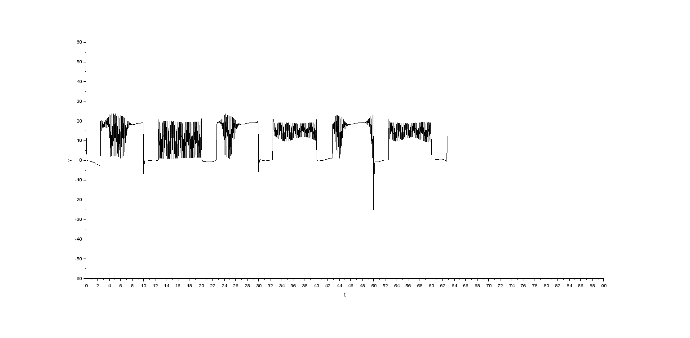
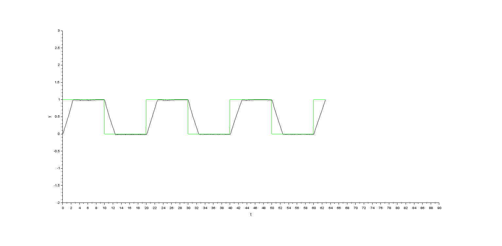

# System Modelling in Scilab's Xcos

## Description

This is my first trial of simulating a control system using Scilab and Xcos. I have implemented a sliding mode controller for a sample system

The control signal supplied to the input port of the plant is shown in 

The reference signal and the plant's output is shown in 