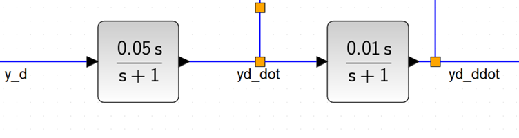
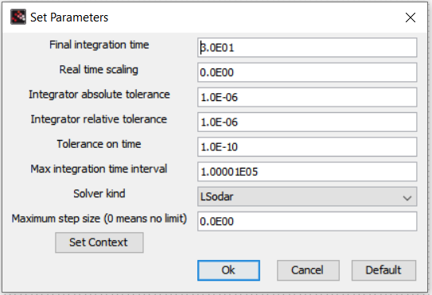
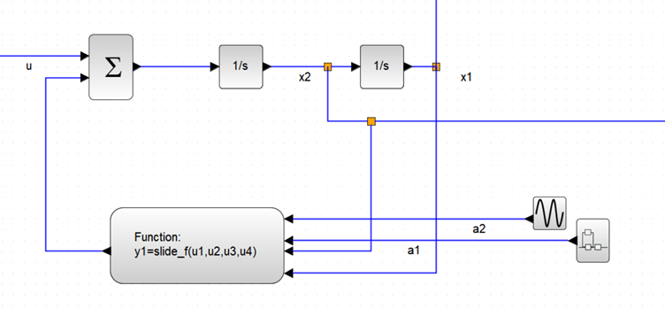
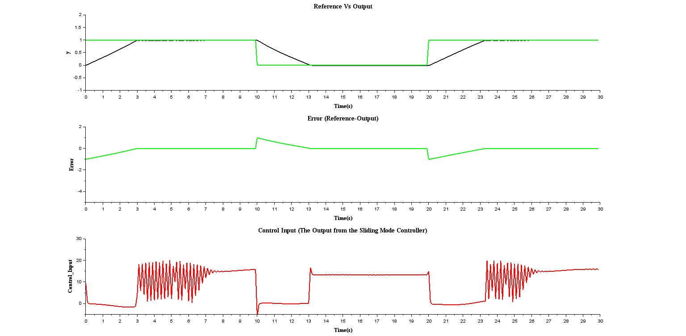

# Sliding Mode Control (SMC) in Scilab's Xcos

## Description

This is my first trial of simulating a control system using Scilab and Xcos. I have implemented a sliding mode controller (SMC) for a sample system.

The controller design steps are as follow:
1. The system dynamics in a state-space representation:
$$\dot{x_1} = x_2$$
$$\dot{x_2} = a_1x_1^2 + a_2x_2 + u$$
System uncertainties or unknown: $-1\leq a_1\leq3$ and $-1\leq a_2\leq1 $.

2. Define the nominal and bound functions:

->The nominal function represents the parts of the system dynamics that we know and its derived as follows: Let $f = a_1x_1^2 + a_2x_2 = f_1+f_2$; since the uncertainty conditions are $-1\leq a_1\leq3$ and $-1\leq a_2\leq1$ as stated above, then:

The nominal $\hat{f_1} = 1x_1^2$ since $a_1 = 1$ the median value of the range [-1,3].
Likewise, $\hat{f_2} = 0x_2$ since $a_2 = 0$ the median value of the range [-1,1].
Hence, the nominal function is  $\hat{f} = x_1^2$

->The bound function can be obtained by subtracting the nominal function from the main function, and getting the magnitude of the result, that is $|f-\hat{f}|$. Hence

 $$|f-\hat{f}| = |(a_1-1)x_1^2 + a_2x_2|$$
 
 Considering the uncertainty conditions stated earlier for $a_1$ and $a_2$, then the bound function can be assumed to be:
 
  $$F = |f-\hat{f}| = 2x_1^2 + |x_2|$$

3. Define the sliding surface **'s'**:
Since the system is 2nd order, we will define **s** as follows.

$$s = \dot{\tilde{x}} + \lambda\tilde{x}$$

$$\dot{s} = \dot{\tilde{x}} + \lambda\dot{\tilde{x}} = (\ddot{x}-\ddot{x^d}) + \lambda(\dot{x}-\dot{x^d})$$

Further simplications can be obtained if:

->
$$\dot{x} = \dot{x_1} = x_2$$
$$\ddot{x} = \dot{x_2} = a_1x_1^2 + a_2x_2 + \lambda x_2 + u$$

->And we substitute the values of F and $\hat{f}$ into the equation above gives

Hence we have that:
$$\dot{s} = \hat{f} + F - \ddot{x^d} + \lambda\dot{x} - \lambda\dot{x^d} + u$$

4. Select the the control output 'u' such that $\dot{s} = 0$:
$$u = \hat{u}+u_s$$

The known (nominal) component of u is:

$$\hat{u} = -\hat{f} + \ddot{x^d} - \lambda x_2 + \lambda \dot{x^d}$$

The unknown (switching) component of u can be defined as:
$$u_s = -FSign(s) - \eta Sign(s) = -(\eta + F)Sign(s)$$

## Scilab/Xcos Implementation Practicalities
It is important to note the following should you decide to build the model on Xcos
1. There is a need to find the first and second order derivatives of reference signal $x_d$. To do this, I used a high pass filter to approximate the differentiators. For the first order derivative high pass filter, I used a gain of $\frac{1}{T}$, where T is the period of the reference signal, since the derivative of a square wave signal should ideally be a set of impulses at the transitions between the lower and upper parts of the square wave. And the second order derivative of the square wave should ideally be 0, so I used a gain of 0.01 for the second high-pass filter. The filters/differentiators are shown in figure below 

2. You might need to adjust the solver settings in the setup of Xcos. Presently, the simulation is quite slow because of the solver I used. The present settings are shown in figure below 
3. While tuning the system, I observed that the plant output's rise time depends majorly on $\eta$. So, the larger the value of  $\eta$, the smaller the rise time and the more chatters there are in the control system.

## Results

The implementation of the plant is shown in figure below 

The figure below shows some useful plots that provides insights into how SMC works .

It is obvious from the last figure that there is a lot of chattering in the control signal sent as an input into the plant. This chattering is majorly due to the switching component $\hat{u}$ of the control output. 

## How to use
1. Install the Scilab/Xcos software through this [download link](https://www.scilab.org/download/scilab-2023.0.0)
2. Once installed, open the scilab desktop application and create the three **.sci** files shown in my repo files above, with the exact name and code(you can copy the code from the repo files and paste them into your scilab notes). These functions are part of the whole SMC control that will run in the simulation environment-Xcos
3. Save and execute these **.sci** files.
4. Download the **sliding_mode.zcos** file from my repo files above and save it to the same file location as the **.sci** files.
5. Open the **sliding_mode.zcos** and start the simulation. Please, kindly note that you might need to adjust the solver for it to work properly.